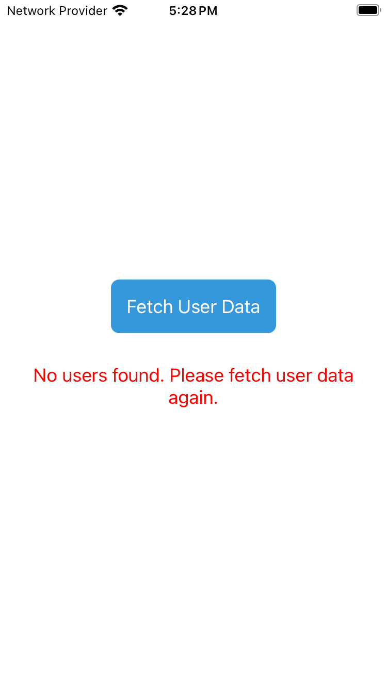
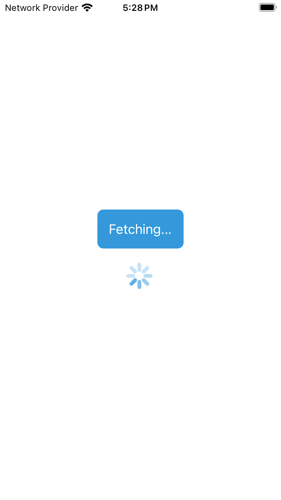
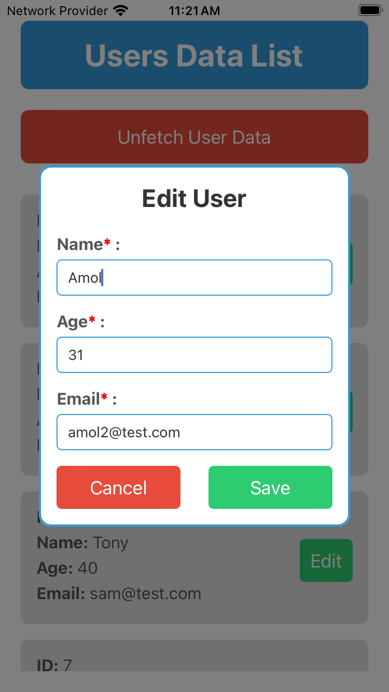
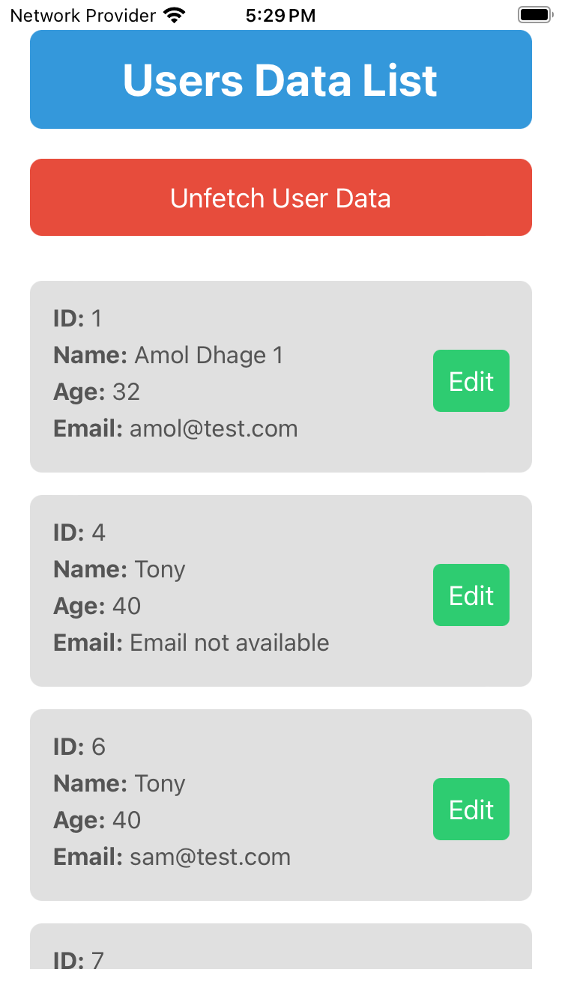

# React Native User Data Management App

This React Native project showcases a user data management system with robust integration of the PUT API method for updating user information. The application allows users to fetch data from a server, edit their details, and seamlessly update the server data. The code is structured for clarity and modularity, providing a practical example for learning and reference.

## Features

- **Screenshots:** Visual representations of the app's functionality.
- **Demo App:** Ideal for learning PUT API integration in React Native.
- **Fetch User Data:** Retrieve user data from a remote server.
- **Edit User Information:** Enable users to modify their name, age, and email.
- **Update User Data:** Utilize PUT requests to update user information on the server.
- **Validation:** Robust input validation to ensure data integrity during user editing.
  - Name: Validates that the name contains only alphabets and single spaces between words.
  - Age: Ensures that the age is a two-digit number between 10 and 99.
  - Email: Verifies the presence of a valid email address.
- **User Interface:** A clean and responsive user interface.

### Screenshots

| Home Screen | Loading Indicator | User Data | Edit User | Updated User Data |
|--------------|--------------------|-----------|-----------|-------------------|
|  |  |  |  |  |

### Demo

| *Demo gif* |
|---------------|
|  |

## Project Structure

The project is structured with the following key components:

| Component        | Description                                                      |
|------------------|------------------------------------------------------------------|
| App Component    | The main component orchestrating the app's functionality.        |
| User Data Fetch  | Utilizes the `fetchUserData` function to fetch user data.         |
| Edit User Data   | Allows users to edit information using PUT requests.             |
| Another Screen   | Additional component or screen for extended functionality.       |
| Styling          | Consistent and visually appealing UI with StyleSheet.             |

## Technologies Used

- React Native
- TypeScript

## How to Use

1. **Clone the Repository:**
    ```bash
    git clone https://github.com/your-username/ReactNative-PutAPI-UpdateUserDataDemoApp.git
    ```

2. **Navigate to the Project Directory:**
    ```bash
    cd ReactNative-UserDataManagementApp
    ```

3. **Install Dependencies:**
    ```bash
    npm install
    ```

4. **Run the App (Android):**
    ```bash
    npx react-native run-android
    ```

5. **Run the App (iOS):**
    ```bash
    npx react-native run-ios
    ```

6. **Explore and Learn:**
   - Fetch user data by tapping "Fetch User Data" and observe the delayed fetch.
   - Edit user information by tapping "Edit" next to a user and update the data.

This project serves as a practical example of integrating PUT API functionality in React Native, providing a valuable resource for learning and reference.


This is a new [**React Native**](https://reactnative.dev) project, bootstrapped using [`@react-native-community/cli`](https://github.com/react-native-community/cli).

# Getting Started

>**Note**: Make sure you have completed the [React Native - Environment Setup](https://reactnative.dev/docs/environment-setup) instructions till "Creating a new application" step, before proceeding.

## Step 1: Start the Metro Server

First, you will need to start **Metro**, the JavaScript _bundler_ that ships _with_ React Native.

To start Metro, run the following command from the _root_ of your React Native project:

```bash
# using npm
npm start

# OR using Yarn
yarn start
```

## Step 2: Start your Application

Let Metro Bundler run in its _own_ terminal. Open a _new_ terminal from the _root_ of your React Native project. Run the following command to start your _Android_ or _iOS_ app:

### For Android

```bash
# using npm
npm run android

# OR using Yarn
yarn android
```

### For iOS

```bash
# using npm
npm run ios

# OR using Yarn
yarn ios
```

If everything is set up _correctly_, you should see your new app running in your _Android Emulator_ or _iOS Simulator_ shortly provided you have set up your emulator/simulator correctly.

This is one way to run your app — you can also run it directly from within Android Studio and Xcode respectively.

## Step 3: Modifying your App

Now that you have successfully run the app, let's modify it.

1. Open `App.tsx` in your text editor of choice and edit some lines.
2. For **Android**: Press the <kbd>R</kbd> key twice or select **"Reload"** from the **Developer Menu** (<kbd>Ctrl</kbd> + <kbd>M</kbd> (on Window and Linux) or <kbd>Cmd ⌘</kbd> + <kbd>M</kbd> (on macOS)) to see your changes!

   For **iOS**: Hit <kbd>Cmd ⌘</kbd> + <kbd>R</kbd> in your iOS Simulator to reload the app and see your changes!

## Congratulations! :tada:

You've successfully run and modified your React Native App. :partying_face:

### Now what?

- If you want to add this new React Native code to an existing application, check out the [Integration guide](https://reactnative.dev/docs/integration-with-existing-apps).
- If you're curious to learn more about React Native, check out the [Introduction to React Native](https://reactnative.dev/docs/getting-started).

# Troubleshooting

If you can't get this to work, see the [Troubleshooting](https://reactnative.dev/docs/troubleshooting) page.

# Learn More

To learn more about React Native, take a look at the following resources:

- [React Native Website](https://reactnative.dev) - learn more about React Native.
- [Getting Started](https://reactnative.dev/docs/environment-setup) - an **overview** of React Native and how setup your environment.
- [Learn the Basics](https://reactnative.dev/docs/getting-started) - a **guided tour** of the React Native **basics**.
- [Blog](https://reactnative.dev/blog) - read the latest official React Native **Blog** posts.
- [`@facebook/react-native`](https://github.com/facebook/react-native) - the Open Source; GitHub **repository** for React Native.

// import React, { useState } from 'react';
// import {
//   Text,
//   View,
//   FlatList,
//   TouchableOpacity,
//   StyleSheet,
//   ActivityIndicator,
//   Alert,
//   Modal,
//   TextInput,
//   Button,
// } from 'react-native';

// interface UserData {
//   id: number;
//   name: string;
//   email: string;
//   age: number;
// }

// const App = () => {
//   const [data, setData] = useState<UserData[]>([]);
//   const [isFetching, setIsFetching] = useState(false);
//   const [showUnfetchButton, setShowUnfetchButton] = useState(false);
//   const [isModalVisible, setIsModalVisible] = useState(false);
//   const [editingUser, setEditingUser] = useState<UserData | null>(null);
//   const [editedName, setEditedName] = useState('');
//   const [editedEmail, setEditedEmail] = useState('');
//   const [editedAge, setEditedAge] = useState(0);

//   const fetchUserData = async () => {
//     try {
//       setIsFetching(true);
//       setShowUnfetchButton(false);

//       const url = 'http://127.0.0.1:3000/users';
//       const response = await fetch(url);

//       if (!response.ok) {
//         throw new Error(`HTTP error! Status: ${response.status}`);
//       }

//       const result: UserData[] = await response.json();
//       setData(result);
//       setShowUnfetchButton(true);
//     } catch (error) {
//       console.error('Error fetching data:', error);
//     } finally {
//       setIsFetching(false);
//     }
//   };

//   const fetchUserDataWithDelay = () => {
//     setIsFetching(true);
//     setTimeout(() => {
//       fetchUserData();
//     }, 2000);
//   };

//   const confirmDeleteUser = (userId: number) => {
//     Alert.alert(
//       'Confirm Deletion',
//       'Are you sure you want to delete this user?',
//       [
//         {
//           text: 'Cancel',
//           style: 'cancel',
//         },
//         {
//           text: 'Yes',
//           onPress: () => deleteUser(userId),
//         },
//       ],
//       { cancelable: false }
//     );
//   };

//   const unfetchUserData = () => {
//     setIsFetching(false);
//     setData([]);
//     setShowUnfetchButton(false);
//   };

//   const deleteUser = async (userId: number) => {
//     try {
//       setIsFetching(true);
//       const url = `http://127.0.0.1:3000/users/${userId}`;
//       const response = await fetch(url, { method: 'DELETE' });

//       if (!response.ok) {
//         throw new Error(`HTTP error! Status: ${response.status}`);
//       }

//       const updatedData = data.filter((user) => user.id !== userId);
//       setData(updatedData);
//     } catch (error) {
//       console.error('Error deleting user:', error);
//     } finally {
//       setIsFetching(false);
//     }
//   };

//   const showEditModal = (user: UserData) => {
//     setEditingUser(user);
//     setEditedName(user.name);
//     setEditedEmail(user.email);
//     setEditedAge(user.age);
//     setIsModalVisible(true);
//   };

//   const closeEditModal = () => {
//     setIsModalVisible(false);
//     setEditingUser(null);
//     setEditedName('');
//     setEditedEmail('');
//     setEditedAge(0);
//   };

//   const saveEdit = async () => {
//     try {
//       setIsFetching(true);

//       const url = `http://127.0.0.1:3000/users/${editingUser?.id}`;
//       const response = await fetch(url, {
//         method: 'PUT',
//         headers: {
//           'Content-Type': 'application/json',
//         },
//         body: JSON.stringify({
//           name: editedName,
//           email: editedEmail,
//           age: editedAge,
//         }),
//       });

//       if (!response.ok) {
//         throw new Error(`HTTP error! Status: ${response.status}`);
//       }

//       const updatedData = data.map((user) =>
//         user.id === editingUser?.id
//           ? { ...user, name: editedName, email: editedEmail, age: editedAge }
//           : user
//       );
//       setData(updatedData);

//       closeEditModal();
//     } catch (error) {
//       console.error('Error updating user data:', error);
//     } finally {
//       setIsFetching(false);
//     }
//   };

//   const renderUserItem = ({ item }: { item: UserData }) => (
//     <View style={styles.userContainer}>
//       <View style={styles.userInfoContainer}>
//         <Text style={styles.userInfoText}>
//           <Text style={styles.boldText}>ID:</Text> {item.id}
//         </Text>
//         <Text style={styles.userInfoText}>
//           <Text style={styles.boldText}>Name:</Text>{' '}
//           {item.name || 'Name not available'}
//         </Text>
//         <Text style={styles.userInfoText}>
//           <Text style={styles.boldText}>Age:</Text>{' '}
//           {item.age || 'Age not available'}
//         </Text>
//         <Text style={styles.userInfoText}>
//           <Text style={styles.boldText}>Email:</Text>{' '}
//           {item.email || 'Email not available'}
//         </Text>
//       </View>
//       <View style={styles.buttonContainer}>
//         <TouchableOpacity
//           style={styles.editButton}
//           onPress={() => showEditModal(item)}
//         >
//           <Text style={styles.buttonText}>Edit</Text>
//         </TouchableOpacity>
//         <TouchableOpacity
//           style={styles.deleteButton}
//           onPress={() => confirmDeleteUser(item.id)}
//         >
//           <Text style={styles.buttonText}>Delete</Text>
//         </TouchableOpacity>
//       </View>
//     </View>
//   );

//   return (
//     <View style={styles.container}>
//       {data.length > 0 && (
//         <View style={styles.headerContainer}>
//           <Text style={styles.headerText}>Users Data List</Text>
//         </View>
//       )}

//       <View style={styles.centeredContainer}>
//         {!showUnfetchButton && (
//           <TouchableOpacity
//             style={styles.fetchButton}
//             onPress={() => fetchUserDataWithDelay()}
//             disabled={isFetching}
//           >
//             <Text style={styles.buttonText}>
//               {isFetching ? 'Fetching...' : 'Fetch User Data'}
//             </Text>
//           </TouchableOpacity>
//         )}

//         {isFetching && <ActivityIndicator size="large" color="#3498db" />}

//         {!isFetching && data.length === 0 && (
//           <Text style={styles.emptyText}>
//             No users found. Please fetch user data again.
//           </Text>
//         )}
//       </View>

//       {showUnfetchButton && (
//         <TouchableOpacity
//           style={styles.unfetchButton}
//           onPress={() => unfetchUserData()}
//           disabled={!data.length}
//         >
//           <Text style={styles.buttonText}>Unfetch User Data</Text>
//         </TouchableOpacity>
//       )}

//       {data.length > 0 && (
//         <FlatList
//           data={data}
//           keyExtractor={(item) => item.id.toString()}
//           renderItem={renderUserItem}
//           style={styles.flatList}
//         />
//       )}

//       <EditModal
//         isVisible={isModalVisible}
//         onClose={closeEditModal}
//         onSave={saveEdit}
//         name={editedName}
//         email={editedEmail}
//         age={editedAge}
//         setName={setEditedName}
//         setEmail={setEditedEmail}
//         setAge={setEditedAge}
//       />
//     </View>
//   );
// };

// const EditModal = ({
//   isVisible,
//   onClose,
//   onSave,
//   name,
//   email,
//   age,
//   setName,
//   setEmail,
//   setAge,
// }) => (
//   <Modal visible={isVisible} animationType="fade" transparent>
//     <View style={styles.modalContainer}>
//       <View style={styles.modalContent}>
//         <Text style={styles.modalTitle}>Edit User</Text>
        
//         <View style={styles.inputContainer}>
//           <Text style={styles.label}>Name:</Text>
//           <TextInput
//             style={styles.input}
//             placeholder="Enter Name"
//             value={name}
//             onChangeText={setName}
//           />
//         </View>

//         <View style={styles.inputContainer}>
//           <Text style={styles.label}>Age:</Text>
//           <TextInput
//             style={styles.input}
//             placeholder="Enter Age"
//             value={age.toString()}
//             onChangeText={(text) => setAge(parseInt(text, 10) || 0)}
//             keyboardType="numeric" // Set keyboardType to 'numeric' for age
//           />
//         </View>

//         <View style={styles.inputContainer}>
//           <Text style={styles.label}>Email:</Text>
//           <TextInput
//             style={styles.input}
//             placeholder="Enter Email"
//             value={email}
//             onChangeText={setEmail}
//             keyboardType="email-address" // Set keyboardType to 'email-address' for email
//           />
//         </View>

//         <View style={styles.modalButtons}>
//           <TouchableOpacity
//             style={[styles.modalButton, styles.cancelButton]}
//             onPress={onClose}
//           >
//             <Text style={styles.buttonText}>Cancel</Text>
//           </TouchableOpacity>
//           <TouchableOpacity
//             style={[styles.modalButton, styles.saveButton]}
//             onPress={onSave}
//           >
//             <Text style={styles.buttonText}>Save</Text>
//           </TouchableOpacity>
//         </View>
//       </View>
//     </View>
//   </Modal>
// );

// const styles = StyleSheet.create({
//   container: {
//     flex: 1,
//     padding: 20,
//     backgroundColor: '#fff',
//   },
//   headerContainer: {
//     backgroundColor: '#3498db',
//     paddingVertical: 15,
//     marginBottom: 20,
//     borderRadius: 8,
//   },
//   headerText: {
//     fontSize: 30,
//     fontWeight: 'bold',
//     color: '#fff',
//     textAlign: 'center',
//   },
//   fetchButton: {
//     backgroundColor: '#3498db',
//     padding: 15,
//     borderRadius: 8,
//     alignItems: 'center',
//     justifyContent: 'center',
//     marginBottom: 20,
//   },
//   unfetchButton: {
//     backgroundColor: '#e74c3c',
//     padding: 15,
//     borderRadius: 8,
//     alignItems: 'center',
//     marginBottom: 20,
//   },
//   buttonText: {
//     color: '#fff',
//     fontSize: 18,
//   },
//   userContainer: {
//     flexDirection: 'row',
//     justifyContent: 'space-between',
//     alignItems: 'center',
//     backgroundColor: '#e0e0e0',
//     padding: 15,
//     marginBottom: 15,
//     borderRadius: 8,
//   },
//   userInfoContainer: {
//     flex: 1,
//   },
//   userInfoText: {
//     fontSize: 16,
//     color: '#555',
//     marginBottom: 5,
//   },
//   boldText: {
//     fontWeight: 'bold',
//   },
//   emptyText: {
//     fontSize: 18,
//     color: 'red',
//     textAlign: 'center',
//     marginTop: 10,
//   },
//   flatList: {
//     marginTop: 10,
//   },
//   centeredContainer: {
//     flex: 1,
//     justifyContent: 'center',
//     alignItems: 'center',
//   },
//   deleteButton: {
//     backgroundColor: '#e74c3c',
//     padding: 10,
//     borderRadius: 5,
//     alignItems: 'center',
//     marginTop: 5,
//     width: '100%',
//   },
//   editButton: {
//     backgroundColor: '#2ecc71',
//     padding: 10,
//     borderRadius: 5,
//     alignItems: 'center',
//     marginTop: 5,
//     width: '100%',
//   },
//   buttonContainer: {
//     flexDirection: 'column',
//     alignItems: 'center',
//   },
//   modalContainer: {
//     flex: 1,
//     justifyContent: 'center',
//     alignItems: 'center',
//     backgroundColor: 'rgba(0, 0, 0, 0.5)',
//   },
//   modalContent: {
//     backgroundColor: '#fff',
//     padding: 15,
//     borderRadius: 12,
//     borderWidth: 2,
//     borderColor: '#3498db',
//     elevation: 5,
//     width: '80%',
//     alignSelf: 'center',
//   },
//   modalTitle: {
//     fontSize: 24,
//     fontWeight: 'bold',
//     color: '#333',
//     marginBottom: 20,
//     textAlign: 'center',
//   },
//   modalButton: {
//     paddingVertical: 10,
//     borderRadius: 5,
//     alignItems: 'center',
//     width: '45%',
//   },
//   cancelButton: {
//     backgroundColor: '#e74c3c',
//   },
//   saveButton: {
//     backgroundColor: '#2ecc71',
//   },
//   inputContainer: {
//     marginBottom: 15,
//   },
//   label: {
//     fontSize: 16,
//     color: '#555',
//     marginBottom: 5,
//   },
//   input: {
//     paddingVertical: 8,
//     paddingHorizontal: 10,
//     borderWidth: 1,
//     borderColor: '#3498db',
//     borderRadius: 5,
//     color: '#333',
//   },
//   modalButtons: {
//     flexDirection: 'row',
//     justifyContent: 'space-between',
//   },
// });

// export default App;